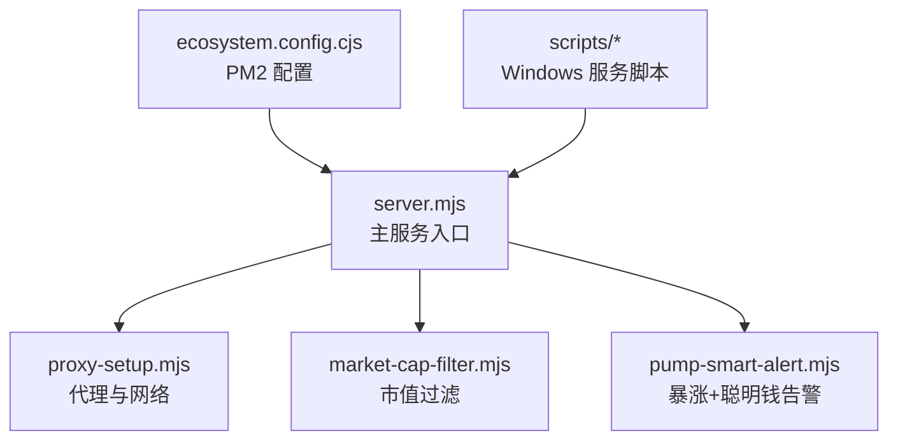
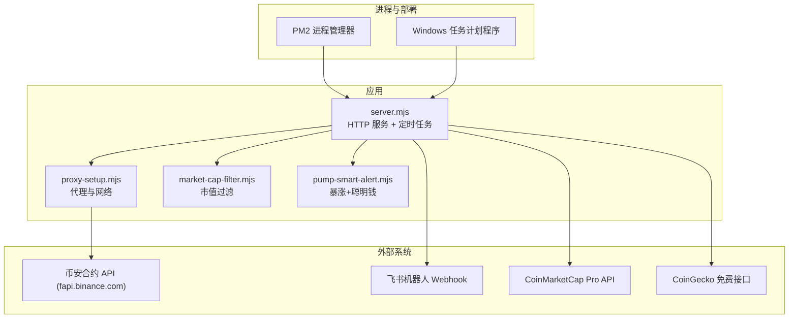
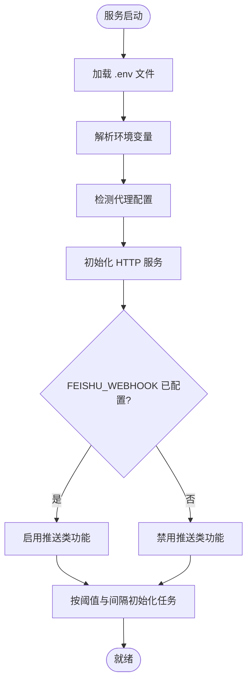
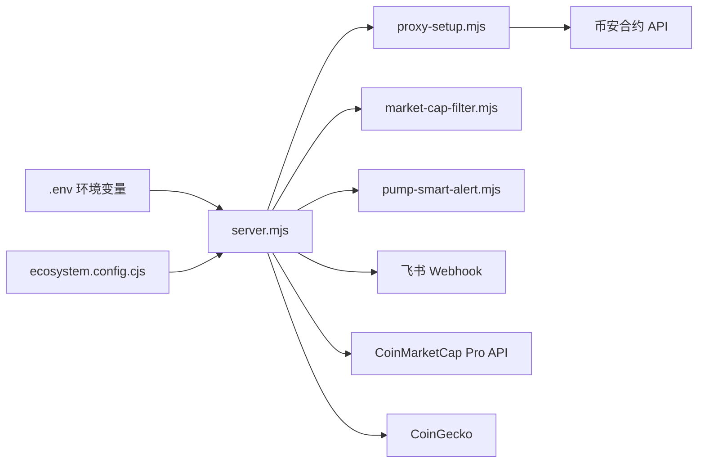

# 配置管理

<cite>
**本文引用的文件**   
- [server.mjs](file://server.mjs)
- [ecosystem.config.cjs](file://ecosystem.config.cjs)
- [market-cap-filter.mjs](file://market-cap-filter.mjs)
- [pump-smart-alert.mjs](file://pump-smart-alert.mjs)
- [proxy-setup.mjs](file://proxy-setup.mjs)
- [README.md](file://README.md)
- [scripts/install-service.ps1](file://scripts/install-service.ps1)
- [scripts/start-service-silent.vbs](file://scripts/start-service-silent.vbs)
- [scripts/run-service.cmd](file://scripts/run-service.cmd)
- [dev-restart.mjs](file://dev-restart.mjs)
</cite>

## 目录
1. [简介](#简介)
2. [项目结构](#项目结构)
3. [核心组件](#核心组件)
4. [架构总览](#架构总览)
5. [详细组件分析](#详细组件分析)
6. [依赖关系分析](#依赖关系分析)
7. [性能考虑](#性能考虑)
8. [故障排查指南](#故障排查指南)
9. [结论](#结论)
10. [附录](#附录)

## 简介
本文件面向运维与策略使用者，系统化梳理本项目的配置体系与环境变量，覆盖：
- 基础运行配置（端口、代理、缓存）
- 推送与告警（飞书 Webhook、推送开关与频率）
- 市值过滤与数据源（CoinMarketCap/CoinGecko）
- PM2 进程管理与 Windows 服务部署
- 策略参数调优（稳趋势、做多/做空、暴涨+聪明钱、持仓健康度、聪明钱趋势看板）
- 不同场景的配置模板与最佳实践
- 配置校验、错误排查与性能优化建议

## 项目结构
本项目为单进程 Node.js HTTP 服务，配合 PM2 或 Windows 任务计划程序实现生产部署。关键入口与配置点如下：
- 主服务：server.mjs（加载 .env、解析环境变量、启动 HTTP 服务与定时任务）
- PM2 配置：ecosystem.config.cjs（进程名、重启策略、日志路径等）
- 市值过滤：market-cap-filter.mjs（MAX_MARKET_CAP_USD 阈值）
- 推送与告警：pump-smart-alert.mjs（暴涨+聪明钱阈值与间隔）
- 代理与网络：proxy-setup.mjs（HTTPS_PROXY/HTTP_PROXY 支持）
- 文档与脚本：README.md、scripts/*（Windows 服务安装与静默启动）

图表来源
- [server.mjs:1-40](file://server.mjs#L1-L40)
- [ecosystem.config.cjs:1-33](file://ecosystem.config.cjs#L1-L33)
- [market-cap-filter.mjs:1-14](file://market-cap-filter.mjs#L1-L14)
- [pump-smart-alert.mjs:1-23](file://pump-smart-alert.mjs#L1-L23)
- [proxy-setup.mjs:1-70](file://proxy-setup.mjs#L1-L70)

章节来源
- [server.mjs:1-40](file://server.mjs#L1-L40)
- [ecosystem.config.cjs:1-33](file://ecosystem.config.cjs#L1-L33)

## 核心组件
本节聚焦与配置强相关的模块职责与关键变量读取位置。

- server.mjs
  - 负责加载 .env、解析环境变量、初始化 HTTP 服务、调度各类扫描与推送任务。
  - 关键配置项包括：PORT、CMC_API_KEY、MC_CACHE_LIMIT、BINANCE_TICKER_CACHE_TTL_SEC、FEISHU_WEBHOOK、STABLE_PUSH_*、LONG_PUSH_*、COMBINED_PUSH_*、PUMP_SMART_ALERT_ENABLED、POSITION_HEALTH_*、SMART_TREND_* 等。
- ecosystem.config.cjs
  - PM2 应用定义：进程名、脚本、实例数、自动重启、内存上限、日志路径、时间戳格式等。
- market-cap-filter.mjs
  - 提供 MAX_MARKET_CAP_USD 与 isEligibleMarketCap/formatMaxMarketCapLabel 工具。
- pump-smart-alert.mjs
  - 暴露 PUMP_SMART_MIN_CHANGE、PUMP_SMART_MIN_SMART_SCORE、PUMP_SMART_SCAN_LIMIT、PUMP_SMART_INTERVAL_MIN、REALTIME_ALERT_INTERVAL_MIN 等阈值与周期。
- proxy-setup.mjs
  - 从 HTTPS_PROXY/HTTP_PROXY 等读取代理地址，并在 Windows 下优先使用 curl 进行请求。

章节来源
- [server.mjs:42-48](file://server.mjs#L42-L48)
- [server.mjs:83-85](file://server.mjs#L83-L85)
- [server.mjs:539-583](file://server.mjs#L539-L583)
- [ecosystem.config.cjs:1-33](file://ecosystem.config.cjs#L1-L33)
- [market-cap-filter.mjs:1-14](file://market-cap-filter.mjs#L1-L14)
- [pump-smart-alert.mjs:1-23](file://pump-smart-alert.mjs#L1-L23)
- [proxy-setup.mjs:1-70](file://proxy-setup.mjs#L1-L70)

## 架构总览
下图展示“配置—服务—外部系统”的交互关系：环境变量驱动服务行为，服务通过代理访问币安合约 API，按策略生成推送至飞书；PM2 或 Windows 任务计划程序负责进程生命周期。

图表来源
- [server.mjs:1-40](file://server.mjs#L1-L40)
- [proxy-setup.mjs:1-70](file://proxy-setup.mjs#L1-L70)
- [market-cap-filter.mjs:1-14](file://market-cap-filter.mjs#L1-L14)
- [pump-smart-alert.mjs:1-23](file://pump-smart-alert.mjs#L1-L23)
- [ecosystem.config.cjs:1-33](file://ecosystem.config.cjs#L1-L33)
- [scripts/install-service.ps1:1-42](file://scripts/install-service.ps1#L1-L42)

## 详细组件分析

### 环境变量清单与说明
以下表格汇总了所有可配置的环境变量，包含作用、默认值与示例。请根据实际环境在 .env 中设置。

- 基础运行
  - PORT
    - 作用：Web 面板监听端口
    - 默认值：3388
    - 示例：PORT=3389
  - NODE_ENV
    - 作用：运行环境标识（PM2 注入）
    - 默认值：production（由 PM2 配置注入）
    - 示例：NODE_ENV=production
  - NO_PROXY / no_proxy
    - 作用：绕过代理的地址白名单（本地回环默认加入）
    - 默认值：localhost,127.0.0.1（当未显式设置时）
    - 示例：NO_PROXY=localhost,127.0.0.1

- 网络与代理
  - HTTPS_PROXY / https_proxy / HTTP_PROXY / http_proxy
    - 作用：指定代理地址（Node fetch 与 curl 均会读取）
    - 默认值：无
    - 示例：HTTPS_PROXY=http://127.0.0.1:7890

- 数据源与缓存
  - CMC_API_KEY
    - 作用：CoinMarketCap Pro API Key；未配置则回退 CoinGecko
    - 默认值：空
    - 示例：CMC_API_KEY=your-cmc-key
  - MC_CACHE_LIMIT
    - 作用：市值列表缓存条目上限
    - 默认值：200
    - 示例：MC_CACHE_LIMIT=200
  - BINANCE_TICKER_CACHE_TTL_SEC
    - 作用：全量 ticker/24hr 缓存 TTL（秒）
    - 默认值：60
    - 示例：BINANCE_TICKER_CACHE_TTL_SEC=60

- 飞书推送
  - FEISHU_WEBHOOK
    - 作用：飞书群机器人 Webhook URL
    - 默认值：空
    - 示例：FEISHU_WEBHOOK=https://open.feishu.cn/open-apis/bot/v2/hook/xxx
  - SMART_TREND_DECISION_WEBHOOK
    - 作用：聪明钱趋势决策专用 Webhook（为空则复用 FEISHU_WEBHOOK）
    - 默认值：空（回退到 FEISHU_WEBHOOK）
    - 示例：SMART_TREND_DECISION_WEBHOOK=https://...

- 市值过滤
  - MAX_MARKET_CAP_USD
    - 作用：监控与推送的市值上限（美元），设为 0 关闭过滤
    - 默认值：5000000000（50 亿）
    - 示例：MAX_MARKET_CAP_USD=5000000000

- 稳趋势推送（右侧稳趋势）
  - STABLE_PUSH_HOURS
    - 作用：推送间隔（小时）
    - 默认值：4
    - 示例：STABLE_PUSH_HOURS=4
  - STABLE_PUSH_ENABLED
    - 作用：是否启用稳趋势推送（false 关闭）
    - 默认值：true（需配置 FEISHU_WEBHOOK）
    - 示例：STABLE_PUSH_ENABLED=true
  - STABLE_SCAN_LIMIT
    - 作用：扫描币种数量
    - 默认值：200
    - 示例：STABLE_SCAN_LIMIT=200
  - STABLE_MAX_DRAWDOWN
    - 作用：最大回撤阈值（小数，如 0.30 表示 30%）
    - 默认值：0.30
    - 示例：STABLE_MAX_DRAWDOWN=0.30

- 做多/综合推荐
  - LONG_PUSH_HOURS / COMBINED_PUSH_HOURS
    - 作用：做多/综合推荐推送间隔（小时）
    - 默认值：4
    - 示例：LONG_PUSH_HOURS=4
  - LONG_PUSH_ENABLED
    - 作用：是否启用做多推送（false 关闭）
    - 默认值：true（需配置 FEISHU_WEBHOOK）
    - 示例：LONG_PUSH_ENABLED=true
  - LONG_SCAN_LIMIT
    - 作用：做多扫描数量
    - 默认值：200
    - 示例：LONG_SCAN_LIMIT=200
  - LONG_MIN_SCORE
    - 作用：做多最低评分阈值
    - 默认值：3
    - 示例：LONG_MIN_SCORE=3

- 暴涨+聪明钱实时告警
  - PUMP_SMART_ALERT_ENABLED
    - 作用：是否启用暴涨+聪明钱告警（false 关闭）
    - 默认值：true（需配置 FEISHU_WEBHOOK）
    - 示例：PUMP_SMART_ALERT_ENABLED=true
  - PUMP_GAINER_ALERT_ENABLED
    - 作用：是否启用涨幅榜告警（true 开启）
    - 默认值：false
    - 示例：PUMP_GAINER_ALERT_ENABLED=true
  - PUMP_SMART_MIN_CHANGE
    - 作用：自 8 点以来涨幅阈值（百分比）
    - 默认值：20
    - 示例：PUMP_SMART_MIN_CHANGE=20
  - PUMP_SMART_MIN_SMART_SCORE
    - 作用：聪明钱信号最低分数
    - 默认值：2
    - 示例：PUMP_SMART_MIN_SMART_SCORE=2
  - PUMP_SMART_SCAN_LIMIT
    - 作用：暴涨扫描数量
    - 默认值：30
    - 示例：PUMP_SMART_SCAN_LIMIT=30
  - PUMP_SMART_INTERVAL_MIN / REALTIME_ALERT_INTERVAL_MIN
    - 作用：扫描与实时告警间隔（分钟）
    - 默认值：60
    - 示例：PUMP_SMART_INTERVAL_MIN=60

- 持仓健康度监控
  - POSITION_HEALTH_ENABLED
    - 作用：是否启用持仓健康度监控（false 关闭）
    - 默认值：true（需配置 FEISHU_WEBHOOK）
    - 示例：POSITION_HEALTH_ENABLED=true
  - POSITION_HEALTH_PUSH_HOURS
    - 作用：健康度推送间隔（小时）
    - 默认值：2
    - 示例：POSITION_HEALTH_PUSH_HOURS=2
  - POSITION_HEALTH_URGENT_CHECK_MIN
    - 作用：紧急检查间隔（分钟）
    - 默认值：30
    - 示例：POSITION_HEALTH_URGENT_CHECK_MIN=30
  - POSITION_HEALTH_URGENT_COOLDOWN_MIN
    - 作用：紧急冷却间隔（分钟）
    - 默认值：60
    - 示例：POSITION_HEALTH_URGENT_COOLDOWN_MIN=60
  - POSITION_HEALTH_WATCH_SYMBOLS
    - 作用：监控币种集合（逗号/空格分隔，自动补 USDT）
    - 默认值：LABUSDT
    - 示例：POSITION_HEALTH_WATCH_SYMBOLS=BTCUSDT,ETHUSDT

- 聪明钱趋势看板
  - SMART_TREND_ENABLED
    - 作用：是否启用聪明钱趋势功能（false 关闭）
    - 默认值：true（需配置 FEISHU_WEBHOOK 或 SMART_TREND_DECISION_WEBHOOK）
    - 示例：SMART_TREND_ENABLED=true
  - SMART_TREND_INTERVAL_MIN
    - 作用：趋势扫描间隔（分钟）
    - 默认值：60
    - 示例：SMART_TREND_INTERVAL_MIN=60
  - SMART_TREND_COOLDOWN_MIN
    - 作用：推送冷却（分钟）
    - 默认值：60
    - 示例：SMART_TREND_COOLDOWN_MIN=60
  - SMART_TREND_RATIO_CHANGE_PCT
    - 作用：多空比变化百分比阈值
    - 默认值：10
    - 示例：SMART_TREND_RATIO_CHANGE_PCT=10
  - SMART_TREND_DIGEST_PAGE_SIZE
    - 作用：摘要分页大小
    - 默认值：10
    - 示例：SMART_TREND_DIGEST_PAGE_SIZE=10
  - SMART_TREND_DYNAMIC_WATCH
    - 作用：是否启用动态关注列表
    - 默认值：true
    - 示例：SMART_TREND_DYNAMIC_WATCH=true
  - SMART_TREND_BOARD_TOP_N
    - 作用：看板 Top N
    - 默认值：20
    - 示例：SMART_TREND_BOARD_TOP_N=20
  - SMART_TREND_VOLUME_TOP_N
    - 作用：成交量 Top N
    - 默认值：50
    - 示例：SMART_TREND_VOLUME_TOP_N=50
  - SMART_TREND_MERGE_CARDS
    - 作用：是否合并卡片推送
    - 默认值：true
    - 示例：SMART_TREND_MERGE_CARDS=true
  - SMART_TREND_MIN_RANKING_VOLUME_24H
    - 作用：最小 24h 排名成交量
    - 默认值：10000000
    - 示例：SMART_TREND_MIN_RANKING_VOLUME_24H=10000000
  - SMART_TREND_WATCHLIST_REFRESH_MIN
    - 作用：关注列表刷新间隔（分钟）
    - 默认值：60
    - 示例：SMART_TREND_WATCHLIST_REFRESH_MIN=60
  - SMART_TREND_WATCH_SYMBOLS
    - 作用：固定关注币种集合（逗号/空格分隔，自动补 USDT）
    - 默认值：空
    - 示例：SMART_TREND_WATCH_SYMBOLS=BTCUSDT,ETHUSDT

- 策略回顾
  - STRATEGY_REVIEW_HOURS
    - 作用：策略回顾周期（小时）
    - 默认值：4（回退到 STABLE_PUSH_HOURS）
    - 示例：STRATEGY_REVIEW_HOURS=4

章节来源
- [server.mjs:42-48](file://server.mjs#L42-L48)
- [server.mjs:83-85](file://server.mjs#L83-L85)
- [server.mjs:539-583](file://server.mjs#L539-L583)
- [market-cap-filter.mjs:1-14](file://market-cap-filter.mjs#L1-L14)
- [pump-smart-alert.mjs:1-23](file://pump-smart-alert.mjs#L1-L23)
- [README.md:142-159](file://README.md#L142-L159)

### PM2 进程管理配置
- 应用名：binace-smart
- 脚本：server.mjs
- 工作目录：项目根目录
- 解释器：node
- 启动参数：--use-env-proxy（启用基于环境变量的代理）
- 实例数：1（fork 模式）
- 自动重启：开启
- 最小运行时长：30s
- 最大重启次数：10
- 重启延迟：10000ms
- 内存上限：512M
- 日志：logs/pm2-out.log、logs/pm2-error.log（合并输出）
- 时间戳格式：YYYY-MM-DD HH:mm:ss
- 平台特性：windowsHide=true（Windows 隐藏控制台窗口）

章节来源
- [ecosystem.config.cjs:1-33](file://ecosystem.config.cjs#L1-L33)

### Windows 服务部署配置
- 安装服务：scripts/install-service.ps1（注册任务计划程序，开机自启）
- 静默启动：scripts/start-service-silent.vbs → scripts/run-service.cmd
- 循环守护：run-service.cmd 内循环启动 server.mjs，并记录 logs/service-out.log 与 logs/service-error.log
- 端口占用处理：安装脚本会尝试释放 3388 端口的旧进程

章节来源
- [scripts/install-service.ps1:1-42](file://scripts/install-service.ps1#L1-L42)
- [scripts/start-service-silent.vbs:1-4](file://scripts/start-service-silent.vbs#L1-L4)
- [scripts/run-service.cmd:1-10](file://scripts/run-service.cmd#L1-L10)

### 策略参数调优建议
- 稳趋势推送
  - 降低 STABLE_SCAN_LIMIT 可减少 API 压力，适合低配额环境
  - 提高 STABLE_MAX_DRAWDOWN 可放宽回撤限制，增加候选数量
  - 调整 STABLE_PUSH_HOURS 控制推送频率，避免信息过载
- 做多/综合推荐
  - LONG_MIN_SCORE 提升可增强信号质量，但可能减少推送数量
  - LONG_SCAN_LIMIT 与扫描成本相关，按需调整
- 暴涨+聪明钱
  - PUMP_SMART_MIN_CHANGE 越大越保守，越小越敏感
  - PUMP_SMART_MIN_SMART_SCORE 越高要求聪明钱确认越强
  - PUMP_SMART_INTERVAL_MIN 控制扫描频率，结合带宽与配额权衡
- 持仓健康度
  - POSITION_HEALTH_URGENT_CHECK_MIN 缩短可更快发现风险，但会增加请求
  - POSITION_HEALTH_WATCH_SYMBOLS 仅监控必要币种，减少开销
- 聪明钱趋势看板
  - SMART_TREND_MIN_RANKING_VOLUME_24H 过滤低流动性标的
  - SMART_TREND_BOARD_TOP_N 与 SMART_TREND_VOLUME_TOP_N 控制看板规模
  - SMART_TREND_RATIO_CHANGE_PCT 影响触发灵敏度

章节来源
- [server.mjs:539-583](file://server.mjs#L539-L583)
- [pump-smart-alert.mjs:1-23](file://pump-smart-alert.mjs#L1-L23)

### 配置验证流程
下图展示了服务启动时的配置加载与校验要点：

图表来源
- [server.mjs:30-40](file://server.mjs#L30-L40)
- [server.mjs:539-583](file://server.mjs#L539-L583)
- [proxy-setup.mjs:1-70](file://proxy-setup.mjs#L1-L70)

章节来源
- [server.mjs:30-40](file://server.mjs#L30-L40)
- [server.mjs:539-583](file://server.mjs#L539-L583)
- [proxy-setup.mjs:1-70](file://proxy-setup.mjs#L1-L70)

### 典型使用场景与配置模板
- 开发调试（本地）
  - 目标：快速启动、最小化外部依赖
  - 建议配置：
    - PORT=3388
    - FEISHU_WEBHOOK=留空（关闭推送）
    - MAX_MARKET_CAP_USD=5000000000
    - BINANCE_TICKER_CACHE_TTL_SEC=60
    - NO_PROXY=localhost,127.0.0.1
- 生产环境（PM2）
  - 目标：稳定运行、自动重启、集中日志
  - 建议配置：
    - NODE_ENV=production（PM2 注入）
    - PORT=3388
    - FEISHU_WEBHOOK=你的飞书 Webhook
    - CMC_API_KEY=你的 CMC Key
    - MAX_MARKET_CAP_USD=5000000000
    - STABLE_PUSH_HOURS=4
    - LONG_MIN_SCORE=3
    - PUMP_SMART_MIN_CHANGE=20
    - BINANCE_TICKER_CACHE_TTL_SEC=60
    - MC_CACHE_LIMIT=200
- 低配额/弱网环境
  - 目标：降低 API 调用频率与并发
  - 建议配置：
    - STABLE_SCAN_LIMIT=100
    - LONG_SCAN_LIMIT=100
    - PUMP_SMART_SCAN_LIMIT=20
    - STABLE_PUSH_HOURS=6
    - PUMP_SMART_INTERVAL_MIN=120
    - BINANCE_TICKER_CACHE_TTL_SEC=120
    - SMART_TREND_INTERVAL_MIN=120
    - SMART_TREND_WATCHLIST_REFRESH_MIN=120
- 高吞吐/多币种监控
  - 目标：扩大扫描范围与看板规模
  - 建议配置：
    - STABLE_SCAN_LIMIT=300
    - LONG_SCAN_LIMIT=300
    - SMART_TREND_BOARD_TOP_N=50
    - SMART_TREND_VOLUME_TOP_N=100
    - SMART_TREND_MIN_RANKING_VOLUME_24H=5000000
    - BINANCE_TICKER_CACHE_TTL_SEC=30
    - MC_CACHE_LIMIT=500

章节来源
- [README.md:142-159](file://README.md#L142-L159)
- [server.mjs:539-583](file://server.mjs#L539-L583)
- [ecosystem.config.cjs:1-33](file://ecosystem.config.cjs#L1-L33)

## 依赖关系分析
- 服务与配置
  - server.mjs 直接读取大量环境变量，决定功能开关与阈值
  - ecosystem.config.cjs 通过 PM2 注入 NODE_ENV 与 node_args
- 网络与代理
  - proxy-setup.mjs 统一处理代理与超时，Windows 下优先 curl
- 数据源
  - 市值数据优先 CMC（需 CMC_API_KEY），失败回退 CoinGecko
  - 币安合约 API 通过 fapi.binance.com 访问
- 推送
  - 飞书 Webhook 作为唯一推送通道，部分功能可独立 Webhook（SMART_TREND_DECISION_WEBHOOK）

图表来源
- [server.mjs:1-40](file://server.mjs#L1-L40)
- [ecosystem.config.cjs:1-33](file://ecosystem.config.cjs#L1-L33)
- [proxy-setup.mjs:1-70](file://proxy-setup.mjs#L1-L70)
- [market-cap-filter.mjs:1-14](file://market-cap-filter.mjs#L1-L14)
- [pump-smart-alert.mjs:1-23](file://pump-smart-alert.mjs#L1-L23)

章节来源
- [server.mjs:1-40](file://server.mjs#L1-L40)
- [ecosystem.config.cjs:1-33](file://ecosystem.config.cjs#L1-L33)
- [proxy-setup.mjs:1-70](file://proxy-setup.mjs#L1-L70)

## 性能考虑
- 缓存策略
  - ticker/24hr 短 TTL 缓存（BINANCE_TICKER_CACHE_TTL_SEC）减少重复请求
  - 市值列表缓存（MC_CACHE_LIMIT）限制内存占用与 I/O
- 并发与去重
  - 同一轮推送期间并发去重，避免重复请求
- 推送节流
  - 合理设置各推送间隔（STABLE_PUSH_HOURS、PUMP_SMART_INTERVAL_MIN、SMART_TREND_INTERVAL_MIN）
- 资源上限
  - PM2 max_memory_restart 防止内存泄漏导致崩溃
- 代理与网络
  - Windows 下优先 curl 提升稳定性
  - 正确配置 NO_PROXY 避免本地请求走代理

[本节为通用指导，不直接分析具体文件]

## 故障排查指南
- 端口被占用
  - 现象：EADDRINUSE
  - 处理：使用 dev-restart.mjs 自动清理旧进程，或手动结束占用端口进程
- 代理不可用
  - 现象：请求超时或地区限制错误
  - 处理：检查 HTTPS_PROXY/HTTP_PROXY 与 NO_PROXY；Windows 下确保 curl 可用
- 飞书推送失败
  - 现象：推送失败或无消息
  - 处理：确认 FEISHU_WEBHOOK 有效；检查 SMART_TREND_DECISION_WEBHOOK 是否覆盖
- 市值数据异常
  - 现象：市值字段缺失或受限
  - 处理：配置 CMC_API_KEY；必要时增大 MC_CACHE_LIMIT
- 推送过多或过少
  - 现象：信息过载或漏报
  - 处理：调整推送间隔与阈值（STABLE_PUSH_HOURS、LONG_MIN_SCORE、PUMP_SMART_MIN_CHANGE 等）

章节来源
- [dev-restart.mjs:18-39](file://dev-restart.mjs#L18-L39)
- [proxy-setup.mjs:25-44](file://proxy-setup.mjs#L25-L44)
- [server.mjs:539-583](file://server.mjs#L539-L583)
- [server.mjs:832-848](file://server.mjs#L832-L848)

## 结论
通过统一的 .env 与环境变量体系，本项目实现了灵活的功能开关与阈值调优。结合 PM2 或 Windows 任务计划程序，可在不同环境下稳定运行。建议在生产环境优先配置 CMC_API_KEY 与 FEISHU_WEBHOOK，并根据业务需求与资源配额调整扫描与推送参数，以获得最佳的准确性与稳定性平衡。

[本节为总结性内容，不直接分析具体文件]

## 附录
- 常用命令
  - 启动服务：pnpm dev 或 pnpm dev:restart
  - 手动触发稳趋势推送：POST /api/trigger-stable-push
- 参考文档
  - README.md 提供了快速开始、API 与报警条件说明

章节来源
- [README.md:95-111](file://README.md#L95-L111)
- [README.md:190-199](file://README.md#L190-L199)