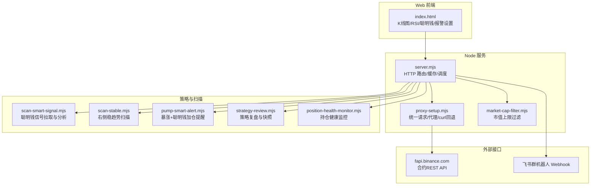
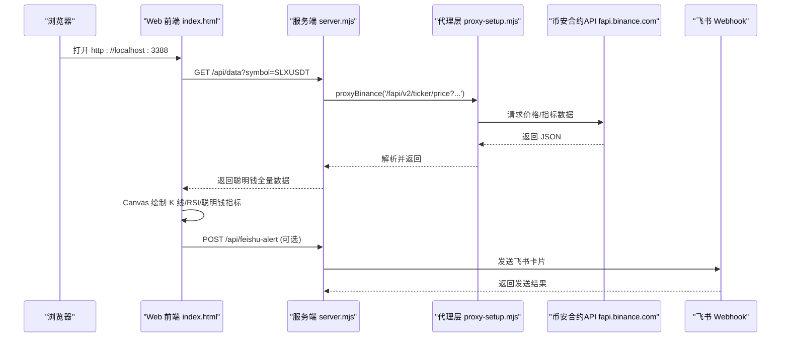
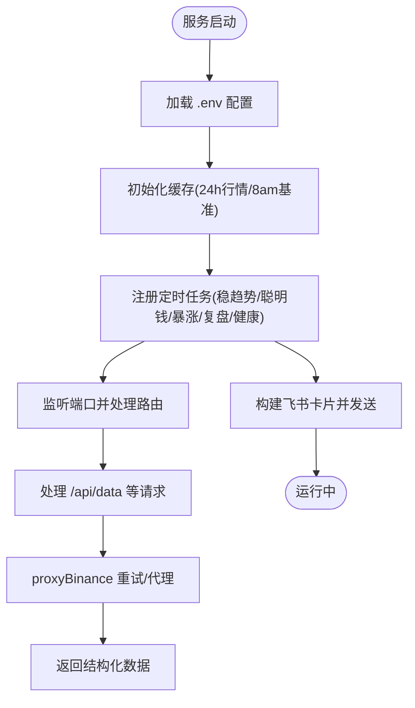
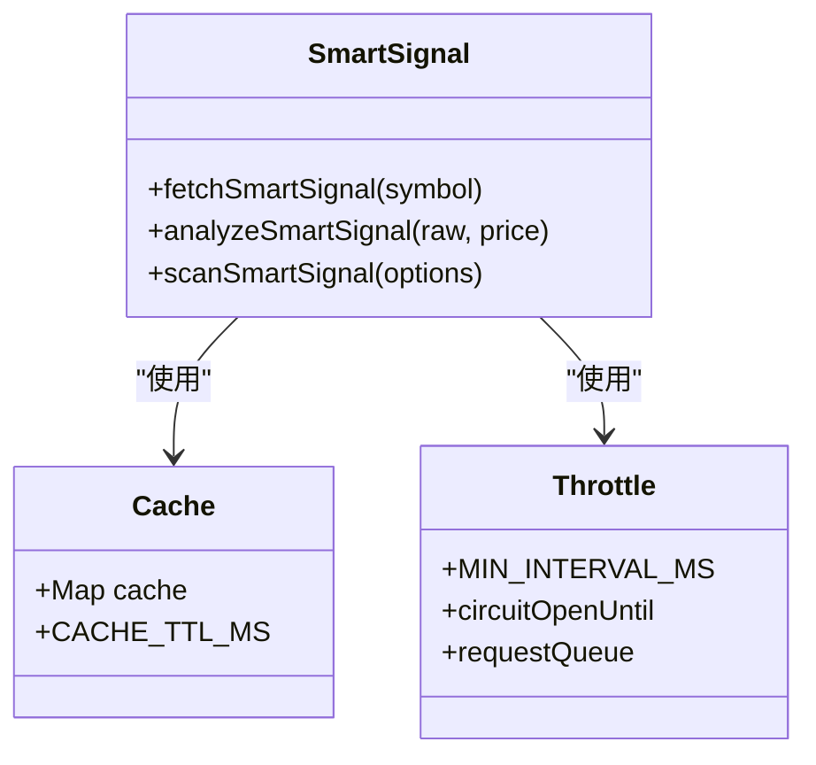
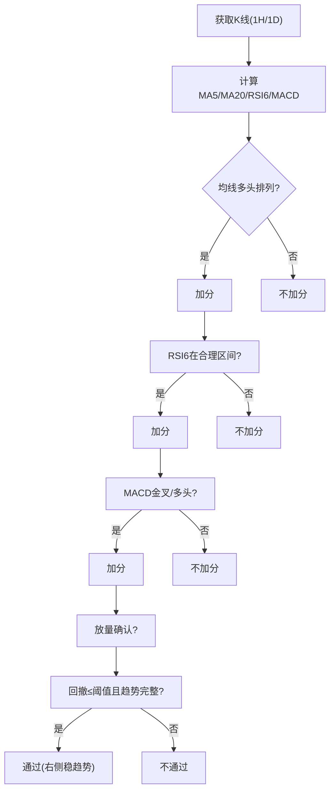
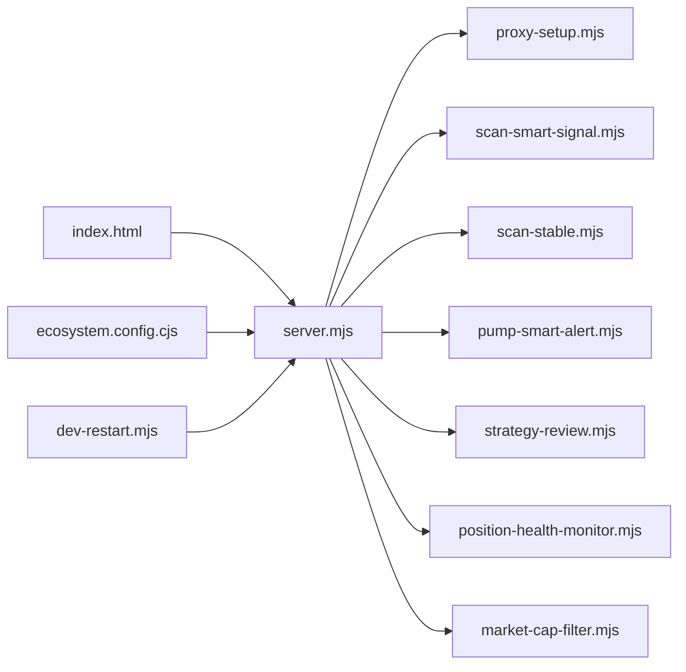

# 项目概述

<cite>
**本文引用的文件**   
- [README.md](file://README.md)
- [package.json](file://package.json)
- [server.mjs](file://server.mjs)
- [index.html](file://index.html)
- [smart-money.mjs](file://smart-money.mjs)
- [proxy-setup.mjs](file://proxy-setup.mjs)
- [market-cap-filter.mjs](file://market-cap-filter.mjs)
- [scan-smart-signal.mjs](file://scan-smart-signal.mjs)
- [scan-stable.mjs](file://scan-stable.mjs)
- [pump-smart-alert.mjs](file://pump-smart-alert.mjs)
- [strategy-review.mjs](file://strategy-review.mjs)
- [position-health-monitor.mjs](file://position-health-monitor.mjs)
- [ecosystem.config.cjs](file://ecosystem.config.cjs)
- [dev-restart.mjs](file://dev-restart.mjs)
</cite>

## 目录
1. [简介](#简介)
2. [项目结构](#项目结构)
3. [核心组件](#核心组件)
4. [架构总览](#架构总览)
5. [详细组件分析](#详细组件分析)
6. [依赖关系分析](#依赖关系分析)
7. [性能与可靠性](#性能与可靠性)
8. [故障排查指南](#故障排查指南)
9. [结论](#结论)
10. [附录：快速开始与环境配置](#附录快速开始与环境配置)

## 简介
BinaceSmart 聪明钱监控面板是一个基于币安合约 API 的实时数据分析工具，提供 Web 面板与终端两种使用方式。系统围绕“聪明钱”（大户/鲸鱼）行为、资金费率、持仓量变化与主动买卖量等指标，结合 K 线图与 RSI 等技术指标，输出信号摘要与报警推送（飞书、浏览器通知），并支持多币种一键切换与市值过滤。

主要目标
- 实时聚合币安合约数据，形成可操作的聪明钱洞察
- 通过 Web 面板可视化呈现 K 线、RSI、聪明钱指标与信号
- 提供定时扫描与报警推送（稳趋势、暴涨+聪明钱加仓、做空风险、策略复盘等）
- 支持终端快速查看单币种关键指标

## 项目结构
- 服务入口与路由：server.mjs
- Web 前端页面：index.html
- 终端监控脚本：smart-money.mjs
- 代理与网络层：proxy-setup.mjs
- 市值过滤：market-cap-filter.mjs
- 聪明钱信号扫描与分析：scan-smart-signal.mjs
- 右侧稳趋势扫描：scan-stable.mjs
- 暴涨+聪明钱加仓提醒：pump-smart-alert.mjs
- 策略复盘与快照：strategy-review.mjs
- 持仓健康监控与推送：position-health-monitor.mjs
- PM2 进程管理配置：ecosystem.config.cjs
- 开发重启与端口释放：dev-restart.mjs

图表来源
- [server.mjs:1-120](file://server.mjs#L1-L120)
- [index.html:1-120](file://index.html#L1-L120)
- [proxy-setup.mjs:1-71](file://proxy-setup.mjs#L1-L71)
- [market-cap-filter.mjs:1-15](file://market-cap-filter.mjs#L1-L15)
- [scan-smart-signal.mjs:1-84](file://scan-smart-signal.mjs#L1-L84)
- [scan-stable.mjs:1-120](file://scan-stable.mjs#L1-L120)
- [pump-smart-alert.mjs:1-90](file://pump-smart-alert.mjs#L1-L90)
- [strategy-review.mjs:1-80](file://strategy-review.mjs#L1-L80)
- [position-health-monitor.mjs:1-60](file://position-health-monitor.mjs#L1-L60)

章节来源
- [README.md:1-210](file://README.md#L1-L210)
- [package.json:1-22](file://package.json#L1-L22)

## 核心组件
- HTTP 服务与路由：提供 /api/data、/api/klines、/api/marketcap、/api/feishu-alert、/api/trigger-stable-push 等接口；内置 ticker/24hr 短 TTL 缓存与并发去重；加载 .env 环境变量；封装 proxyBinance 重试机制。
- 代理与网络层：统一 fetchJson，Windows + 代理场景优先 curl；自动启用 NODE_USE_ENV_PROXY；对地区限制与限流进行提示与熔断。
- 聪明钱信号模块：调用币安公开 smart-money signal 接口，带缓存、限流队列与熔断保护；输出方向、评分与明细信号。
- 右侧稳趋势模块：基于 K 线均线、RSI、MACD、成交量与回撤阈值筛选“右侧稳趋势”，支持双周期确认与严格趋势校验。
- 暴涨+聪明钱加仓提醒：在涨幅达标基础上叠加聪明钱加仓信号（大户持仓偏多↑、OI增仓+涨、主动买入↑、大户>全网等）。
- 策略复盘：保存预测快照，按周期对比实际涨跌榜，生成反思与建议，支持飞书推送。
- 持仓健康监控：评估用户持仓健康度与止损/止盈触发，支持紧急冷却与整点报告。
- Web 前端：Canvas 绘制 K 线与 RSI，十字光标显示 OHLCV 与涨跌幅，支持报警条件设置与飞书推送开关。

章节来源
- [server.mjs:58-125](file://server.mjs#L58-L125)
- [proxy-setup.mjs:25-71](file://proxy-setup.mjs#L25-L71)
- [scan-smart-signal.mjs:76-167](file://scan-smart-signal.mjs#L76-L167)
- [scan-stable.mjs:91-193](file://scan-stable.mjs#L91-L193)
- [pump-smart-alert.mjs:12-87](file://pump-smart-alert.mjs#L12-L87)
- [strategy-review.mjs:64-148](file://strategy-review.mjs#L64-L148)
- [position-health-monitor.mjs:72-128](file://position-health-monitor.mjs#L72-L128)
- [index.html:479-626](file://index.html#L479-L626)

## 架构总览
系统采用 Node.js 原生 HTTP 服务器作为后端，前端通过 Canvas 渲染图表，后端统一代理币安合约 REST API，并提供缓存、重试与并发控制。定时任务负责稳趋势扫描、聪明钱整点摘要、暴涨提醒、策略复盘与持仓健康推送，结果通过飞书卡片或 Webhook 推送。

图表来源
- [server.mjs:508-538](file://server.mjs#L508-L538)
- [proxy-setup.mjs:49-71](file://proxy-setup.mjs#L49-L71)
- [index.html:628-800](file://index.html#L628-L800)

## 详细组件分析

### 服务端与路由（server.mjs）
- 功能要点
  - 读取 .env 并注入 process.env
  - 封装 proxyBinance 重试与错误处理
  - ticker/24hr 短 TTL 缓存 + 并发去重
  - 8am 基准价计算与缓存
  - 市值过滤与 TradFi 排除
  - 定时任务：稳趋势推送、聪明钱整点摘要、暴涨提醒、策略复盘、持仓健康
  - 飞书卡片 V2 发送与频控重试
- 关键流程
  - 启动时加载配置与依赖模块
  - 监听端口并处理 /api/* 路由
  - 根据环境开启推送与扫描任务

图表来源
- [server.mjs:31-48](file://server.mjs#L31-L48)
- [server.mjs:58-125](file://server.mjs#L58-L125)
- [server.mjs:508-538](file://server.mjs#L508-L538)
- [server.mjs:599-644](file://server.mjs#L599-L644)

章节来源
- [server.mjs:1-120](file://server.mjs#L1-L120)
- [server.mjs:508-538](file://server.mjs#L508-L538)
- [server.mjs:599-644](file://server.mjs#L599-L644)

### 代理与网络层（proxy-setup.mjs）
- 功能要点
  - 从环境变量启用 Node fetch 代理（需 --use-env-proxy）
  - Windows + 代理场景优先使用 curl 执行请求
  - 统一超时、错误信息格式化与地区限制提示
- 适用场景
  - 解决跨域与代理稳定性问题
  - 提高在受限网络环境的可用性

章节来源
- [proxy-setup.mjs:1-71](file://proxy-setup.mjs#L1-L71)

### 市值过滤（market-cap-filter.mjs）
- 功能要点
  - MAX_MARKET_CAP_USD 默认 $50亿，可通过 .env 调整
  - isEligibleMarketCap 判断是否纳入监控/推送
- 影响范围
  - 扫描列表、推送内容、单币监控面板

章节来源
- [market-cap-filter.mjs:1-15](file://market-cap-filter.mjs#L1-L15)

### 聪明钱信号（scan-smart-signal.mjs）
- 功能要点
  - 调用币安 smart-money signal 接口，带缓存与限流队列
  - 熔断保护：418/429/403 时记录熔断时间并拒绝后续请求
  - analyzeSmartSignal 输出方向、评分与明细信号
- 复杂度
  - 并发 pmap 控制扫描速度，避免触发限流

图表来源
- [scan-smart-signal.mjs:16-84](file://scan-smart-signal.mjs#L16-L84)
- [scan-smart-signal.mjs:86-167](file://scan-smart-signal.mjs#L86-L167)
- [scan-smart-signal.mjs:182-238](file://scan-smart-signal.mjs#L182-L238)

章节来源
- [scan-smart-signal.mjs:1-238](file://scan-smart-signal.mjs#L1-L238)

### 右侧稳趋势（scan-stable.mjs）
- 功能要点
  - 基于 MA5/MA20、RSI6、MACD、成交量与回撤阈值筛选
  - 支持双周期确认（1H+1D）与严格趋势模式
  - scanRightStable 输出符合“右侧稳趋势”的币种集合
- 算法要点
  - calcMA/calcRSI/calcMACD 本地计算
  - calcDrawdownFromPeak 计算近期回撤
  - isTrendIntact/isTrendIntactStrict 趋势完整性判定

图表来源
- [scan-stable.mjs:8-139](file://scan-stable.mjs#L8-L139)
- [scan-stable.mjs:141-193](file://scan-stable.mjs#L141-L193)

章节来源
- [scan-stable.mjs:1-290](file://scan-stable.mjs#L1-L290)

### 暴涨+聪明钱加仓提醒（pump-smart-alert.mjs）
- 功能要点
  - 条件：8点以来涨幅≥阈值 + 聪明钱连续加仓（≥N项确认）
  - 确认因子：大户持仓偏多↑、OI增仓+涨、主动买入↑、大户>全网
- 输出
  - 表格元素用于飞书卡片展示，含首次/重复提醒计数

章节来源
- [pump-smart-alert.mjs:1-191](file://pump-smart-alert.mjs#L1-L191)

### 策略复盘（strategy-review.mjs）
- 功能要点
  - 保存预测快照（做多/做空/稳趋势/暴跌）
  - 按周期对比实际涨跌榜，统计遗漏与失误
  - 生成反思与建议，支持飞书推送
- 持久化
  - strategy-predictions.json、strategy-reviews.json

章节来源
- [strategy-review.mjs:1-377](file://strategy-review.mjs#L1-L377)

### 持仓健康监控（position-health-monitor.mjs）
- 功能要点
  - 评估持仓健康度（healthy/warning/critical）
  - 紧急状态冷却，避免频繁推送
  - 整点报告与即时预警
- 集成
  - 与用户持仓数据与当前价格联动

章节来源
- [position-health-monitor.mjs:1-186](file://position-health-monitor.mjs#L1-L186)

### Web 前端（index.html）
- 功能要点
  - Canvas 绘制 K 线与 RSI，十字光标显示 OHLCV 与振幅/涨跌幅
  - 多币种预设与自定义增删，URL 参数同步
  - 报警设置：价格突破/跌破、RSI 超买超卖、大户翻多翻空、买卖激增
  - 飞书推送开关与手动触发稳趋势推送
- 交互
  - 左侧概览、信号摘要、智能信号面板、策略管理与模拟交易区

章节来源
- [index.html:1-800](file://index.html#L1-L800)

### 终端版（smart-money.mjs）
- 功能要点
  - 并行拉取价格、大户多空比、全网多空比、持仓量、主动买卖量、资金费率
  - 彩色终端输出与信号摘要
  - 循环刷新，支持自定义币种与间隔

章节来源
- [smart-money.mjs:1-149](file://smart-money.mjs#L1-L149)

## 依赖关系分析
- 直接依赖
  - server.mjs 依赖 proxy-setup.mjs、scan-smart-signal.mjs、scan-stable.mjs、pump-smart-alert.mjs、strategy-review.mjs、position-health-monitor.mjs、market-cap-filter.mjs
  - index.html 通过 /api/* 与服务端交互
  - ecosystem.config.cjs 定义 PM2 进程配置
  - dev-restart.mjs 负责端口释放与子进程启动
- 外部依赖
  - 币安合约 REST API（fapi.binance.com）
  - 飞书群机器人 Webhook
  - CoinMarketCap Pro API（可选，市值数据）

图表来源
- [server.mjs:1-28](file://server.mjs#L1-L28)
- [ecosystem.config.cjs:1-33](file://ecosystem.config.cjs#L1-L33)
- [dev-restart.mjs:1-79](file://dev-restart.mjs#L1-L79)

章节来源
- [server.mjs:1-28](file://server.mjs#L1-L28)
- [ecosystem.config.cjs:1-33](file://ecosystem.config.cjs#L1-L33)
- [dev-restart.mjs:1-79](file://dev-restart.mjs#L1-L79)

## 性能与可靠性
- 缓存与去重
  - ticker/24hr 短 TTL 缓存 + inflight 并发去重，减少重复请求
  - 8am 基准价缓存，降低 klines 查询压力
- 并发控制
  - pmap 实现可控并发，避免瞬时高负载
- 重试与熔断
  - proxyBinance 指数退避重试
  - Smart Signal 限流熔断，防止 418/429/403 风暴
- 资源限制
  - PM2 配置 max_memory_restart 与日志轮转
- 建议
  - 合理设置 TICKER_24HR_CACHE_TTL_SEC 与 SMART_TREND_INTERVAL_MIN
  - 在高并发场景下适当降低 concurrency 参数

[本节为通用指导，无需源码引用]

## 故障排查指南
- 端口占用
  - 使用 pnpm dev:restart 自动结束占用端口进程
  - 手动 netstat/taskkill 清理
- 代理与网络
  - 检查 HTTPS_PROXY/HTTP_PROXY 是否正确
  - Windows 下优先 curl 回退，确保 curl.exe 可用
- 限流与地区限制
  - Smart Signal 熔断后等待 retry-after 再试
  - 地区限制错误提示来自 proxy-setup.mjs
- 飞书推送失败
  - 检查 FEISHU_WEBHOOK 配置
  - 频控错误会抛出异常，建议降低推送频率

章节来源
- [dev-restart.mjs:19-67](file://dev-restart.mjs#L19-L67)
- [proxy-setup.mjs:25-44](file://proxy-setup.mjs#L25-L44)
- [scan-smart-signal.mjs:37-55](file://scan-smart-signal.mjs#L37-L55)
- [server.mjs:599-644](file://server.mjs#L599-L644)

## 结论
BinaceSmart 以轻量 Node.js 服务为核心，整合币安合约数据与聪明钱指标，提供直观的 Web 面板与终端视图，并通过飞书推送实现自动化监控与决策辅助。系统在缓存、并发、重试与熔断方面具备较好的工程实践，适合个人交易者与小型团队使用。

[本节为总结性内容，无需源码引用]

## 附录：快速开始与环境配置

- 环境要求
  - Node.js >= 20
- 安装与启动
  - Web 面板（推荐）：pnpm dev:restart → 访问 http://localhost:3388
  - 终端版：node smart-money.mjs SLXUSDT 60
- 端口被占用
  - 使用 pnpm dev:restart 自动释放端口
  - 或在 .env 修改 PORT
- 飞书推送配置
  - 在 .env 设置 FEISHU_WEBHOOK
- 市值 API 配置（可选）
  - 在 .env 设置 CMC_API_KEY，未配置则回退 CoinGecko
- 市值过滤
  - MAX_MARKET_CAP_USD 默认 $50亿，设为 0 关闭过滤
- 常用命令
  - npm run monitor / monitor:btc / monitor:eth
  - PM2 管理：ecosystem.config.cjs

章节来源
- [README.md:17-121](file://README.md#L17-L121)
- [package.json:9-18](file://package.json#L9-L18)
- [ecosystem.config.cjs:1-33](file://ecosystem.config.cjs#L1-L33)